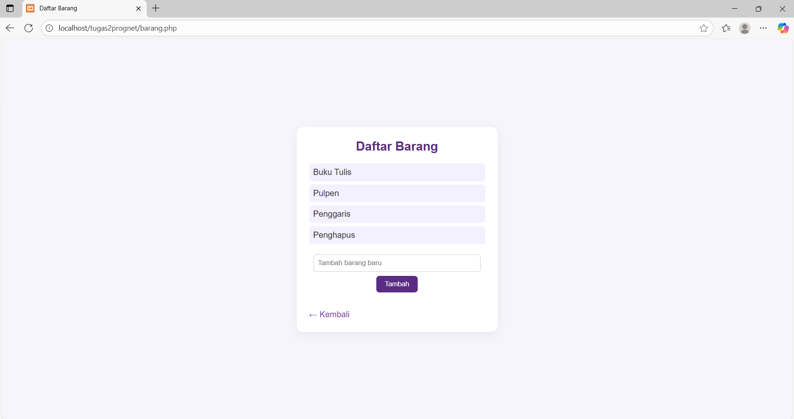
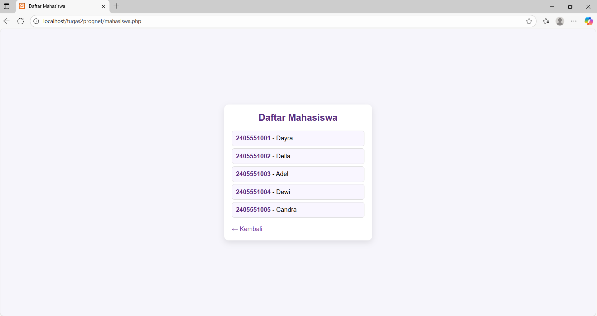
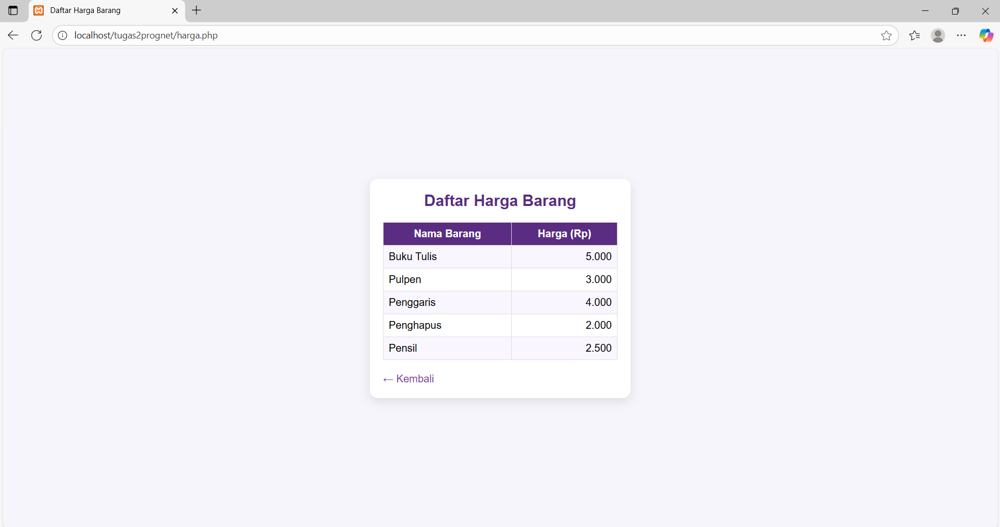
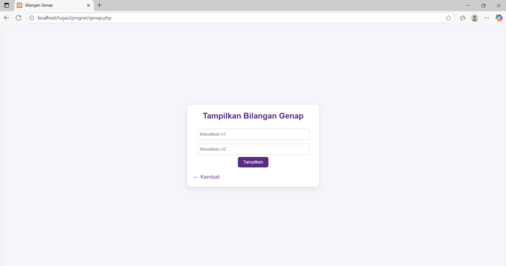
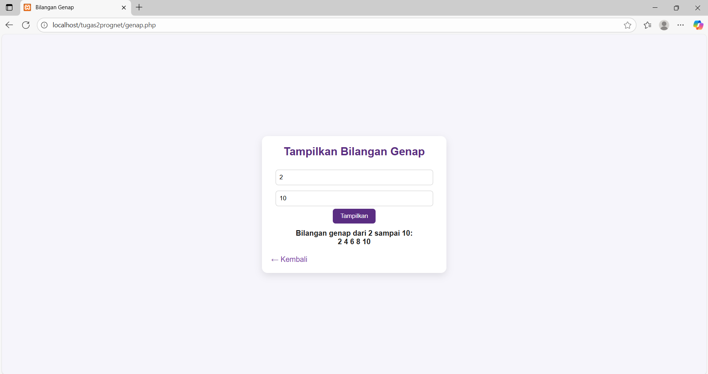
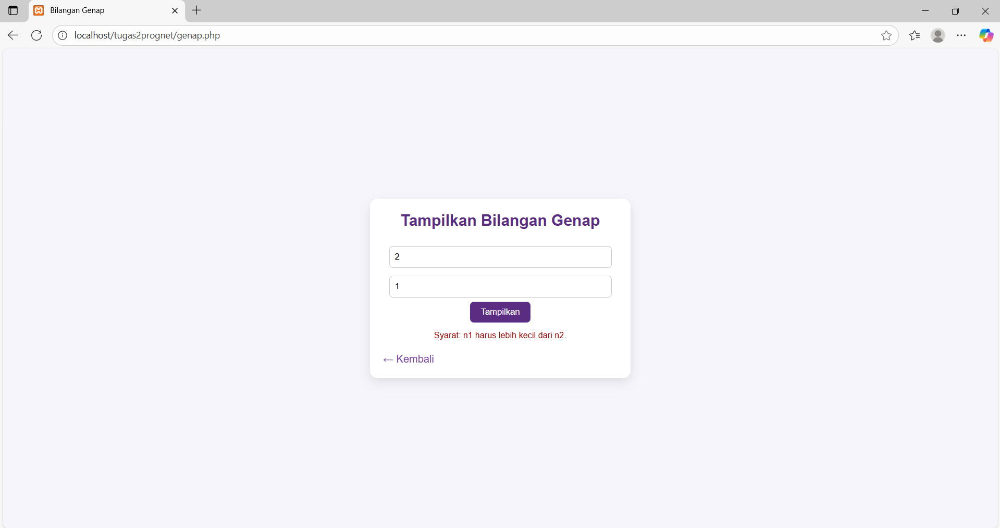
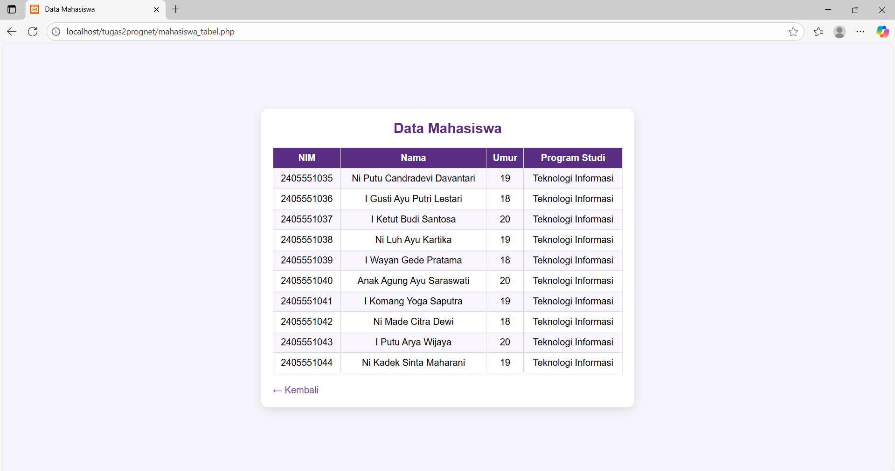
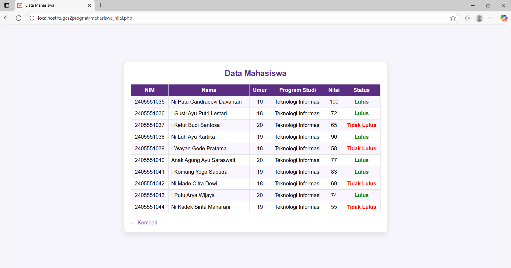

# 📚 Tugas Pemrograman Internet

✨ Selamat datang di repositori Tugas PHP Dasar!  
Proyek ini dibuat sebagai tugas praktik Pemrograman Internet, fokus pada materi **variabel**, **operator**, **kondisi ('if', 'switch-case')**, **looping ('for', 'foreach')**, **form input & validasi**, dan **array (indexed, associative, multidimensi)** dengan PHP.

## 👤 Identitas
Nama   : Ni Putu Candradevi Davantari  
NIM    : 2405551035  
Kelas  : Pemrograman Internet B  

## 📋 Daftar Program

Di dalam proyek ini terdapat beberapa file program dengan alur form → input → validasi → output:

| No | Nama Program | Folder | Fungsi Singkat |
|----|--------------|--------|----------------|
| 1  | **Form Ucapan** | `tugas1` | Input nama → validasi huruf/spasi → tampilkan ucapan |
| 2  | **Kalkulator Sederhana** | `tugas1` | Input dua angka + operator (tambah, kurang, kali, bagi) → hasil dengan `switch-case` |
| 3  | **Ganjil / Genap** | `tugas1` | Menentukan apakah angka input ganjil atau genap |
| 4  | **Nilai Huruf** | `tugas1` | Mengonversi nilai numerik ke nilai huruf (A, B, C, dst.), dengan validasi |
| 5  | **Menu Makanan** | `tugas1` | Pengguna memilih menu → tampilkan harga menu dengan `switch-case` |
| 6  | **Form Biodata** | `tugas1` | Input data pribadi singkat (nama, umur, alamat, dll.) → tampilkan biodata dengan format deskriptif |
| 7  | **Daftar Barang (Array)** | `tugas2` | Array sederhana → tampilkan daftar barang dengan `foreach` |
| 8  | **Daftar Mahasiswa (Associative Array)** | `tugas2` | Array associative dengan NIM (key) & Nama (value) → tampilkan pakai `foreach` |
| 9  | **Daftar Harga Barang** | `tugas2` | Array associative barang → harga → tampilkan dalam tabel HTML rapi |
| 10 | **Bilangan Genap (Looping For)** | `tugas2` | Input n1 & n2 → tampilkan semua bilangan genap dengan `for` (syarat n1 < n2) |
| 11 | **Data Mahasiswa (Array Multidimensi)** | `tugas2` | Array multidimensi berisi Nim, Nama, Umur, Prodi → tampilkan dalam tabel HTML |
| 12 | **Data Mahasiswa + Nilai (Array + Kondisi)** | `tugas2` | Tambahkan atribut nilai → tampilkan status **Lulus/Tidak Lulus** dengan `if` |

## 📸 Screenshot Hasil

Berikut ini screenshot hasil tiap program:
### 1. Form Ucapan  

### 2. Kalkulator

### 3. Bilangan Ganjil / Genap

### 4. Nilai Huruf

### 5. Menu Makanan

### 6. Form Biodata

---

### 1. Daftar Barang

### 2. Daftar Mahasiswa (Associative Array)

### 3. Daftar Harga Barang

### 4. Bilangan Genap (Looping For)

### 5. Data Mahasiswa (Array Multidimensi)

### 6. Data Mahasiswa + Nilai (Array + Kondisi)

📌 Semua screenshot di atas menunjukkan hasil dari program yang telah dibuat untuk memenuhi **Tugas PHP Dasar** pada mata kuliah **Pemrograman Internet**.  
Program ini mencakup latihan penggunaan variabel, operator, kondisi, dan form input-output menggunakan PHP.

Terima Kasih

