# Tugas 1 Pemrograman Internet

✨ Selamat datang di repositori Tugas PHP Dasar!  
Proyek ini dibuat sebagai tugas praktik Pemrograman Internet, fokus pada materi **variabel**, **operator**, **kondisi**, **form**, dan **validasi data** dengan PHP.

Nama   : Ni Putu Candradevi Davantari  
NIM    : 2405551035  
Kelas  : Pemrograman Internet B  

## 📋 Daftar Program

Di dalam proyek ini terdapat beberapa file program dengan alur form → input → validasi → output:

| No | Nama Program | Fungsi Singkat |
|----|----------------------------|-------------------------------|
| 1 | **Form Ucapan** | Input nama → validasi huruf/spasi → tampilkan ucapan |
| 2 | **Kalkulator Sederhana** | Input dua angka + operator (tambah, kurang, kali, bagi) → hasil dengan `switch-case` |
| 3 | **Ganjil / Genap** | Menentukan apakah angka input ganjil atau genap |
| 4 | **Nilai Huruf** | Mengonversi nilai numerik ke nilai huruf (A, B, C, dst.), dengan validasi |
| 5 | **Menu Makanan** | Pengguna memilih menu → menghitung total harga → cek stok & validasi |
| 6 | **Form Biodata** | Input data pribadi singkat (nama, umur, alamat, dll.) → tampilkan biodata dengan format deskriptif |

## 📸 Screenshot Hasil

Berikut ini screenshot hasil tiap program:
### 1. Form Ucapan  
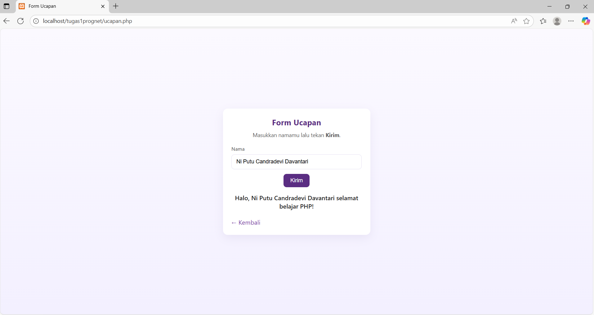

### 2. Kalkulator

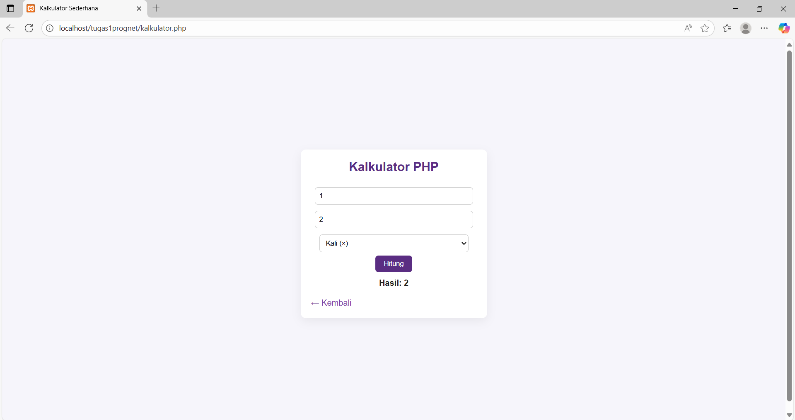

### 3. Bilangan Ganjil / Genap
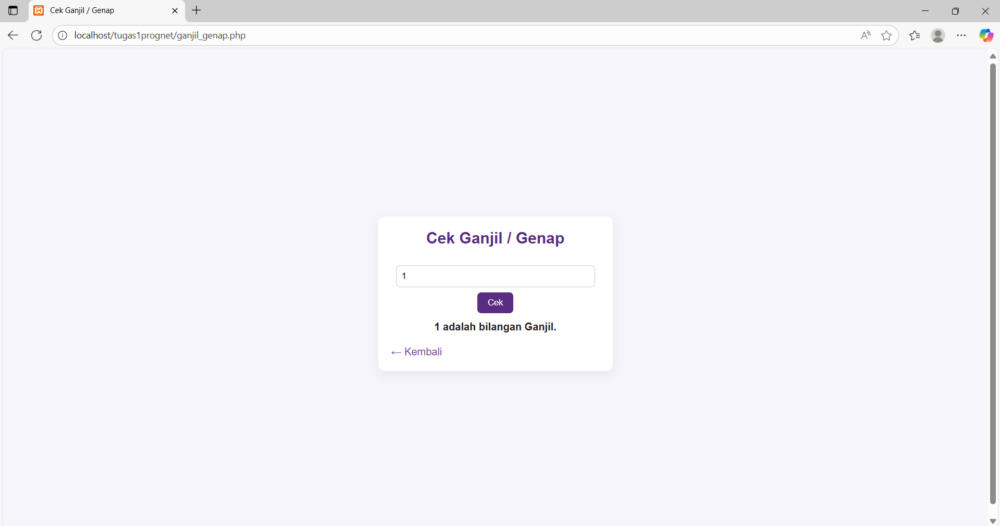
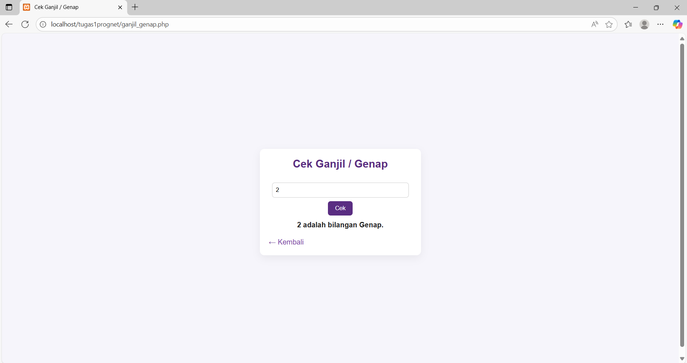

### 4. Nilai Huruf
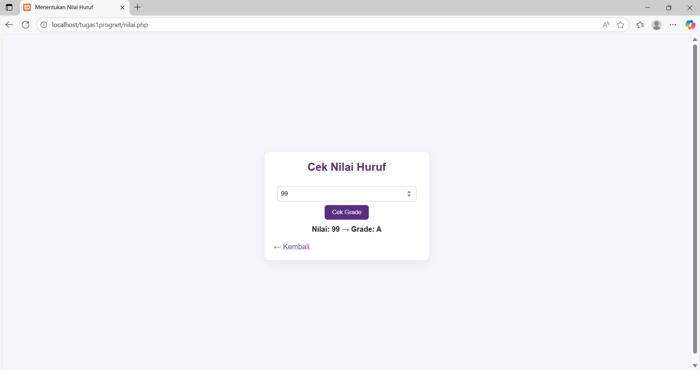
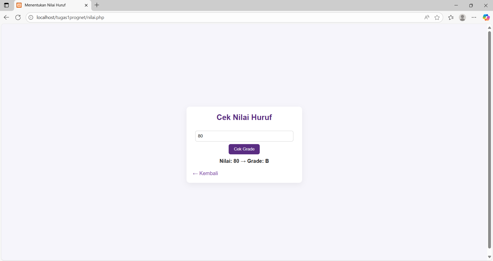

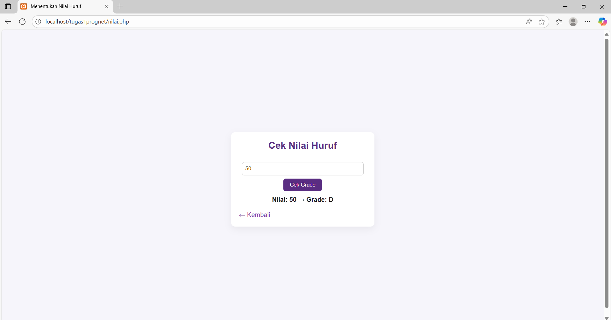
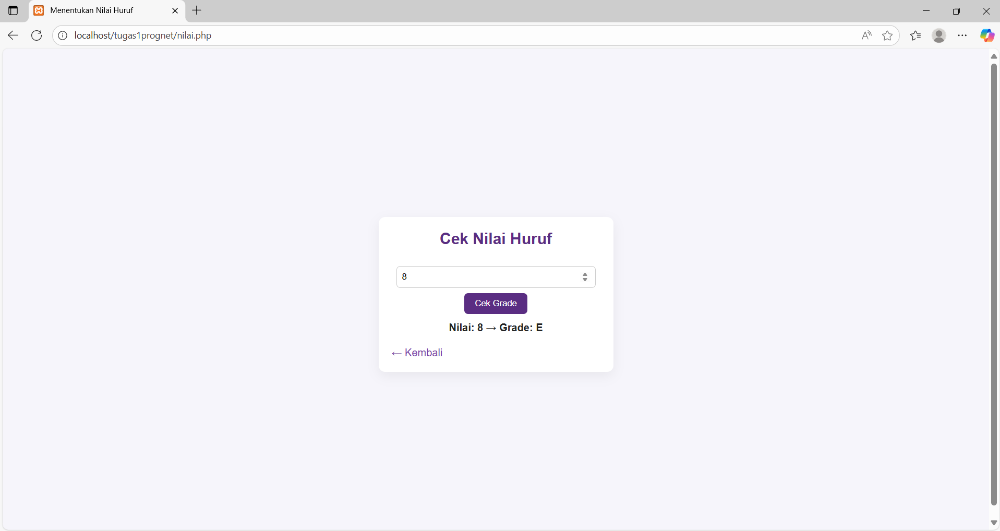

### 5. Menu Makanan

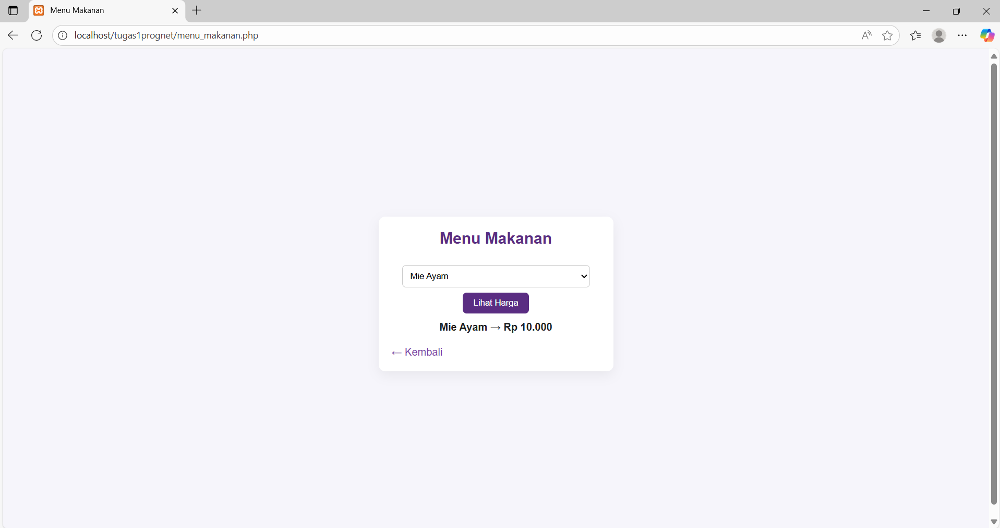
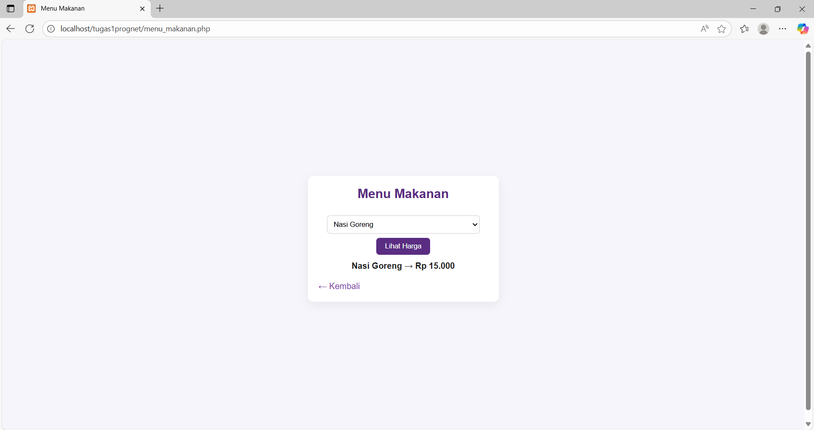
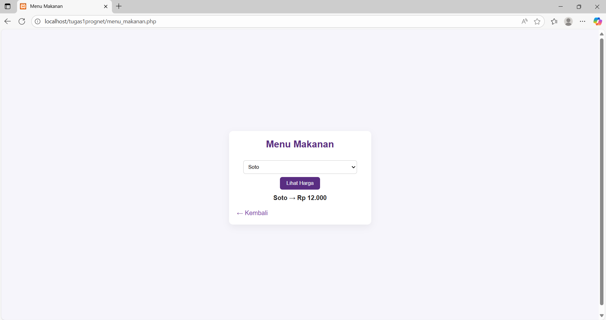

### 6. Form Biodata

